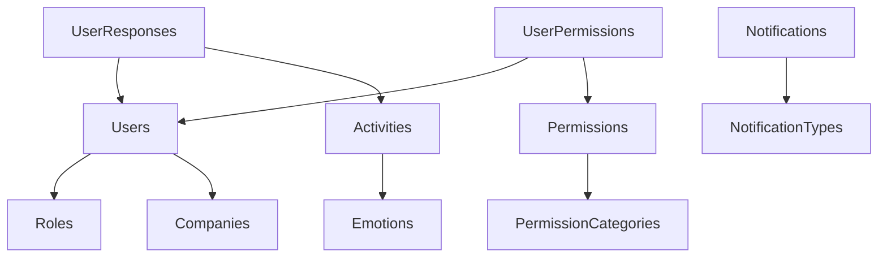

# Inside Vibra's MongoDB Architecture

The backbone of any robust application is its data model. In this post, we'll explore the MongoDB database architecture that powers the Vibra platform, examining how we've structured our data to support educational activities, user management, and organizational needs.

:::tip
MongoDB's document-oriented approach gives us the flexibility to evolve our data model as Vibra's requirements grow, while maintaining performance at scale.
:::

{/* truncate */}

## Domain-Driven Database Design

Vibra's database architecture follows domain-driven design principles, organizing collections into logical domains that reflect the business capabilities of the application:

- **User Management**: Handling authentication, authorization, and user profiles
- **Activities and Learning**: Managing educational content and user interactions
- **Notifications**: Supporting real-time user communication
- **Permissions and Access Control**: Implementing fine-grained security
- **Organizations**: Managing institutional hierarchies
- **System Configuration**: Controlling application behavior
- **Audit and Reporting**: Tracking system usage and generating insights

## Key Collections and Relationships

Let's explore some of the most important collections in our database and how they relate to each other:

### Activities Domain

The Activities collection is central to Vibra's educational functionality:

```js
// Example Activity document
{
  "_id": ObjectId("60d21b4667d0d8992e610c85"),
  "id": "act-emotional-awareness-1",
  "emotions": "joy,surprise",
  "title": "Emotional Awareness Exercise",
  "resources": [
    {
      "type": "video",
      "url": "https://resources.vibra.co/videos/emotional-awareness.mp4",
      "duration": 180,
      "metadata": {
        "author": "Dr. Emma Rodriguez",
        "language": "es"
      }
    }
  ],
  "questions": [
    {
      "id": "q1",
      "questionText": "How did you feel after watching the video?",
      "type": "multiple-choice",
      "options": ["Happy", "Confused", "Inspired", "Neutral"],
      "correctAnswer": null,
      "points": 5
    }
  ],
  "difficulty": 2,
  "isActive": true,
  "schedule": {
    "date": ISODate("2025-06-15T00:00:00Z"),
    "weekNumber": 24,
    "year": 2025
  },
  "createdAt": ISODate("2025-05-10T14:30:00Z")
}
```

Activities are linked to Emotions, which categorize the emotional learning objectives:

```js
// Example Emotion document
{
  "_id": ObjectId("60d21b4667d0d8992e610c86"),
  "id": "joy",
  "name": "Joy",
  "orientationNote": "Focus on positive experiences and gratitude",
  "description": "A feeling of great pleasure and happiness",
  "icono": "joy-icon.svg",
  "percentNote": 85
}
```

When users complete activities, their responses are stored in the UserResponses collection:

```js
// Example UserResponse document
{
  "_id": ObjectId("60d21b4667d0d8992e610c87"),
  "user": "user123",
  "activity": "act-emotional-awareness-1",
  "responses": [
    {
      "questionId": "q1",
      "answer": "Inspired",
      "isCorrect": null,
      "responseTime": 12
    }
  ],
  "score": 5,
  "startTime": ISODate("2025-06-16T10:15:00Z"),
  "endTime": ISODate("2025-06-16T10:18:30Z"),
  "timeSpent": 210,
  "createdAt": ISODate("2025-06-16T10:18:30Z"),
  "updatedAt": ISODate("2025-06-16T10:18:30Z")
}
```

### User Management Domain

The Users collection stores comprehensive information about system users:

```js
// Example User document
{
  "_id": ObjectId("60d21b4667d0d8992e610c88"),
  "name": "Maria Garcia",
  "documentType": ObjectId("60d21b4667d0d8992e610c89"),
  "documentNumber": "1098765432",
  "email": "maria.garcia@example.com",
  "username": "maria.garcia",
  "password": "$2a$10$hKDVYxLefVHV/vtuPhWD3OigtRyOykRLDdUAp80Z1crSoS1lFqaFS",
  "role": ObjectId("60d21b4667d0d8992e610c8a"),
  "company": ObjectId("60d21b4667d0d8992e610c8b"),
  "isActive": true,
  "createdAt": ISODate("2025-01-15T08:30:00Z")
}
```

## Smart Database Design Patterns

Our MongoDB implementation leverages several design patterns that enhance maintainability and performance:

### 1. Embedded Documents for Related Data

We use embedded documents for closely related data that is always accessed together. For example, Activity documents embed Resources and Questions, optimizing read performance by reducing the need for joins.

### 2. References for Shared Data

For data that is shared across multiple documents (like Users referenced by UserResponses), we use references to maintain data integrity and avoid duplication.

### 3. Soft Deletion Pattern

Instead of permanently removing data, most collections implement soft deletion with `deleted` and `deletedAt` fields, preserving data for auditing while removing it from active use.

### 4. Comprehensive Audit Trails

Most collections include creation and modification timestamps and user references, enabling detailed tracking of data changes over time.

## Visualization of Key Relationships

The diagram below illustrates the core relationships in our database:



## Performance Considerations

To ensure optimal performance, we've implemented several strategies:

1. **Strategic Indexing**: We've created indexes on frequently queried fields to speed up searches
2. **Data Denormalization**: Where appropriate, we denormalize data to reduce the need for complex joins
3. **Pagination**: For large collections, we implement pagination to limit result sizes
4. **Compound Indexes**: For queries that filter on multiple fields, we use compound indexes

## Conclusion

Vibra's MongoDB architecture demonstrates how a well-designed database schema can support complex application requirements while maintaining flexibility and performance. By organizing collections into logical domains and implementing smart design patterns, we've created a data foundation that can evolve with the application's needs.

In future posts, we'll explore how our front-end components interact with this database structure and how we've implemented real-time features using MongoDB change streams.

<div className="alert alert--info" style={{marginTop: '2rem'}}>
  <strong>Want to learn more?</strong> Check out our <a href="../docs/aplicaciones/model-schema-db">detailed database schema documentation</a> for a comprehensive reference.
</div>
