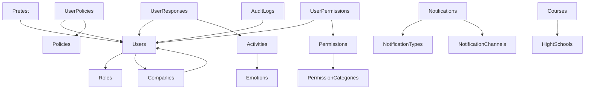

# Mongo DB

# Database Schema Documentation

This document provides a comprehensive overview of the MongoDB database schema used in the Vibra application. The schema is organized by domain categories, with detailed descriptions of each collection, its fields, data types, and relationships with other collections.

## Table of Contents

- [User Management](#user-management)
- [Activities and Learning](#activities-and-learning)
- [Notifications](#notifications)
- [Permissions and Access Control](#permissions-and-access-control)
- [Organizations](#organizations)
- [System Configuration](#system-configuration)
- [Audit and Reporting](#audit-and-reporting)
- [File Storage](#file-storage)

## Preview

## User Management

### Users

The Users collection stores information about system users, including personal details, authentication information, and system access settings.

| Field | Type | Description |
|-------|------|-------------|
| _id | ObjectId | Primary key |
| name | String | User's full name |
| documentType | ObjectId | Reference to document type |
| documentNumber | String | User's identification number |
| address | String | User's physical address |
| phoneNumber | String | User's contact number |
| email | String | User's email address |
| username | String | User's login username |
| password | String | Encrypted password |
| createdAt | DateTime | Creation timestamp |
| createdBy | String | Creator reference |
| editedAt | DateTime | Last edit timestamp |
| editedBy | String | Last editor reference |
| deleted | Boolean | Soft deletion flag |
| deletedAt | DateTime | Deletion timestamp |
| isActive | Boolean | Account status |
| role | ObjectId | Reference to Roles collection |
| company | ObjectId | Reference to Companies collection |
| gender | String | User's gender |
| isLogged | Boolean | Current login status |
| avatar | String | Profile image reference |
| birthDate | DateTime | User's date of birth |
| updatedAt | DateTime | Last update timestamp |
| __v | Int | Version number |

**Relationships:**
- Users → Roles (Many-to-One): Each user has one role
- Users → Companies (Many-to-One): Each user belongs to one company

### UserPolicies

Tracks user acceptance of system policies and terms.

| Field | Type | Description |
|-------|------|-------------|
| _id | ObjectId | Primary key |
| userId | ObjectId | Reference to Users collection |
| policyId | ObjectId | Reference to Policies collection |
| userPolicyKey | String | Unique identifier for user-policy pair |
| version | String | Policy version accepted |
| isAccepted | Boolean | Acceptance status |
| ipAddress | String | IP address during acceptance |
| userAgent | String | Browser/device information |
| acceptedAt | DateTime | Acceptance timestamp |
| createdAt | DateTime | Creation timestamp |
| updatedAt | DateTime | Last update timestamp |
| __v | Int | Version number |

**Relationships:**
- UserPolicies → Users (Many-to-One): Each policy acceptance belongs to one user
- UserPolicies → Policies (Many-to-One): Each policy acceptance refers to one policy

### Roles

Defines user roles and their administrative capabilities.

| Field | Type | Description |
|-------|------|-------------|
| _id | ObjectId | Primary key |
| serial | String | Unique identifier |
| name | String | Role name |
| description | String | Role description |
| isSuperAdmin | Boolean | Super admin privileges flag |
| isActive | Boolean | Role status |
| createdAt | DateTime | Creation timestamp |
| createdBy | String | Creator reference |
| __v | Int | Version number |
| deleted | Boolean | Soft deletion flag |
| deletedAt | DateTime | Deletion timestamp |
| editedAt | DateTime | Last edit timestamp |
| permissionTemplate | String | Template for role permissions |

**Relationships:**
- Roles → Users (One-to-Many): Each role can be assigned to multiple users

## Activities and Learning

### Activities

Stores educational activities and their associated resources and questions.

| Field | Type | Description |
|-------|------|-------------|
| _id | ObjectId | Primary key |
| id | String | Activity identifier |
| emotions | String | Associated emotions |
| title | String | Activity title |
| resources | Resources[] | Array of learning resources |
| questions | Questions[] | Array of assessment questions |
| difficulty | Int | Difficulty level |
| isActive | Boolean | Activity status |
| schedule | Schedule | Scheduling information |
| createdAt | DateTime | Creation timestamp |

**Relationships:**
- Activities → Emotions (Many-to-One): Activities are associated with emotions
- Activities → UserResponses (One-to-Many): Each activity can have multiple user responses

### Resources

Embedded document within Activities that defines learning materials.

| Field | Type | Description |
|-------|------|-------------|
| type | String | Resource type (video, article, etc.) |
| url | String | Resource location |
| duration | Int | Length in seconds/minutes |
| metadata | Metadatas | Additional resource information |

### Metadatas

Embedded document within Resources that provides additional context.

| Field | Type | Description |
|-------|------|-------------|
| author | String | Content creator |
| language | String | Content language |

### Questions

Embedded document within Activities that defines assessment questions.

| Field | Type | Description |
|-------|------|-------------|
| id | String | Question identifier |
| questionText | String | The question itself |
| type | String | Question type (multiple choice, etc.) |
| options | String[] | Possible answers |
| correctAnswer | String | The correct answer |
| points | Int | Point value |

### Schedule

Embedded document within Activities that defines when activities should be available.

| Field | Type | Description |
|-------|------|-------------|
| date | DateTime | Scheduled date |
| weekNumber | Int | Week number |
| year | Int | Year |

### Emotions

Defines emotional categories used in activities.

| Field | Type | Description |
|-------|------|-------------|
| _id | ObjectId | Primary key |
| id | String | Emotion identifier |
| name | String | Emotion name |
| orientationNote | String | Guidance note |
| description | String | Detailed description |
| icono | String | Icon reference |
| percentNote | Int | Percentage indicator |

**Relationships:**
- Emotions → Activities (One-to-Many): Each emotion can be associated with multiple activities

### UserResponses

Stores user answers to activity questions and performance metrics.

| Field | Type | Description |
|-------|------|-------------|
| _id | ObjectId | Primary key |
| user | String | Reference to user |
| activity | String | Reference to activity |
| responses | UserResponse[] | Array of individual responses |
| score | Int | Total score achieved |
| startTime | DateTime | When user started the activity |
| endTime | DateTime | When user completed the activity |
| timeSpent | Int | Duration in seconds |
| createdAt | DateTime | Creation timestamp |
| updatedAt | DateTime | Last update timestamp |
| __v | Int | Version number |

**Relationships:**
- UserResponses → Users (Many-to-One): Each response set belongs to one user
- UserResponses → Activities (Many-to-One): Each response set is for one activity

### UserResponse

Embedded document within UserResponses that stores individual question responses.

| Field | Type | Description |
|-------|------|-------------|
| _id | ObjectId | Primary key |
| questionId | String | Reference to question |
| answer | String | User's answer |
| isCorrect | Boolean | Correctness flag |
| responseTime | Int | Time taken to answer |

### Pretest

Stores preliminary assessment results.

| Field | Type | Description |
|-------|------|-------------|
| _id | ObjectId | Primary key |
| testId | String | Test identifier |
| userId | String | User reference |
| responses | PretestResponse[] | Array of responses |
| __v | Int | Version number |

**Relationships:**
- Pretest → Users (Many-to-One): Each pretest belongs to one user

### PretestResponse

Embedded document within Pretest that stores individual question responses.

| Field | Type | Description |
|-------|------|-------------|
| questionId | String | Reference to question |
| answer | String | User's answer |

## Notifications

### Notifications

Stores system notifications sent to users.

| Field | Type | Description |
|-------|------|-------------|
| _id | ObjectId | Primary key |
| ID | String | Notification identifier |
| title | String | Notification title |
| message | String | Notification content |
| isRead | Boolean | Read status |
| client | String | Target client |
| notificationType | String | Reference to notification type |
| notificationChannel | String | Reference to notification channel |
| priority | Int | Importance level |
| serial | String | Unique identifier |
| isActive | Boolean | Active status |
| deleted | Boolean | Soft deletion flag |
| deletedAt | DateTime | Deletion timestamp |
| createdAt | DateTime | Creation timestamp |
| __v | Int | Version number |

**Relationships:**
- Notifications → NotificationTypes (Many-to-One): Each notification has one type
- Notifications → NotificationChannels (Many-to-One): Each notification uses one channel

### NotificationTypes

Defines categories of notifications.

| Field | Type | Description |
|-------|------|-------------|
| _id | ObjectId | Primary key |
| title | String | Type name |
| description | String | Type description |
| level | Int | Importance level |

**Relationships:**
- NotificationTypes → Notifications (One-to-Many): Each type can be used by multiple notifications

### NotificationChannels

Defines delivery methods for notifications.

| Field | Type | Description |
|-------|------|-------------|
| _id | ObjectId | Primary key |
| title | String | Channel name |
| description | String | Channel description |
| level | Int | Priority level |

**Relationships:**
- NotificationChannels → Notifications (One-to-Many): Each channel can be used by multiple notifications

## Permissions and Access Control

### Permissions

Defines system permissions that can be assigned to users.

| Field | Type | Description |
|-------|------|-------------|
| _id | ObjectId | Primary key |
| serial | String | Unique identifier |
| name | String | Permission name |
| description | String | Permission description |
| permissionCategory | String | Reference to category |
| isActive | Boolean | Permission status |
| createdAt | DateTime | Creation timestamp |
| createdBy | String | Creator reference |
| __v | Int | Version number |
| deleted | Boolean | Soft deletion flag |
| deletedAt | DateTime | Deletion timestamp |
| deletedBy | String | Deleter reference |

**Relationships:**
- Permissions → PermissionCategories (Many-to-One): Each permission belongs to one category
- Permissions → UserPermissions (One-to-Many): Each permission can be assigned to multiple users

### PermissionCategories

Groups permissions into logical categories.

| Field | Type | Description |
|-------|------|-------------|
| _id | ObjectId | Primary key |
| serial | String | Unique identifier |
| name | String | Category name |
| description | String | Category description |
| isActive | Boolean | Category status |
| createdAt | DateTime | Creation timestamp |
| createdBy | String | Creator reference |
| __v | Int | Version number |

**Relationships:**
- PermissionCategories → Permissions (One-to-Many): Each category can contain multiple permissions

### UserPermissions

Links users to their assigned permissions.

| Field | Type | Description |
|-------|------|-------------|
| _id | ObjectId | Primary key |
| user | String | Reference to user |
| permission | String | Reference to permission |
| serial | String | Unique identifier |
| isActive | Boolean | Assignment status |
| deleted | Boolean | Soft deletion flag |
| createdAt | DateTime | Creation timestamp |
| createdBy | String | Creator reference |
| deletedAt | DateTime | Deletion timestamp |
| __v | Int | Version number |
| deletedBy | String | Deleter reference |

**Relationships:**
- UserPermissions → Users (Many-to-One): Each permission assignment belongs to one user
- UserPermissions → Permissions (Many-to-One): Each permission assignment refers to one permission

### Policies

Stores system policies and terms that users must accept.

| Field | Type | Description |
|-------|------|-------------|
| _id | ObjectId | Primary key |
| title | String | Policy title |
| content | String | Policy text |
| version | String | Policy version |
| isActive | Boolean | Policy status |
| type | String | Policy type |
| effectiveDate | DateTime | When policy takes effect |
| createdAt | DateTime | Creation timestamp |
| updatedAt | DateTime | Last update timestamp |

**Relationships:**
- Policies → UserPolicies (One-to-Many): Each policy can have multiple user acceptances

## Organizations

### Companies

Stores information about organizations using the system.

| Field | Type | Description |
|-------|------|-------------|
| _id | ObjectId | Primary key |
| name | String | Company name |
| nit | String | Tax identification number |
| address | String | Physical address |
| email | String | Contact email |
| phoneNumber | Long | Contact number |
| managerData | ManagerData | Manager information |
| createdAt | DateTime | Creation timestamp |
| deleted | Boolean | Soft deletion flag |
| deletedAt | DateTime | Deletion timestamp |
| isActive | Boolean | Company status |
| slogan | String | Company motto |
| userAdmin | String | Admin user reference |
| editedAt | DateTime | Last edit timestamp |
| isMain | Boolean | Primary company flag |

**Relationships:**
- Companies → Users (One-to-Many): Each company can have multiple users
- Companies → ManagerData (One-to-One): Each company has one manager data record

### ManagerData

Embedded document within Companies that stores manager information.

| Field | Type | Description |
|-------|------|-------------|
| name | String | Manager name |
| documentType | String | ID type |
| document | String | ID number |
| email | String | Contact email |
| phoneNumber | String | Contact number |

### HightSchools

Stores information about educational institutions.

| Field | Type | Description |
|-------|------|-------------|
| _id | ObjectId | Primary key |
| id | String | School identifier |
| name | String | School name |
| address | String | Physical address |
| nit | String | Tax identification number |
| email | String | Contact email |
| __v | Int | Version number |

**Relationships:**
- HightSchools → Courses (One-to-Many): Each school can have multiple courses

### Courses

Stores information about courses offered by schools.

| Field | Type | Description |
|-------|------|-------------|
| _id | ObjectId | Primary key |
| id | String | Course identifier |
| name | String | Course name |
| hightSchool | String | Reference to school |

**Relationships:**
- Courses → HightSchools (Many-to-One): Each course belongs to one school

### Clients

Stores information about client organizations.

| Field | Type | Description |
|-------|------|-------------|
| _id | ObjectId | Primary key |
| name | String | Client name |
| nit | String | Tax identification number |
| epsCode | String | Health provider code |
| address | String | Physical address |
| phoneNumber | String | Contact number |
| email | String | Contact email |
| overdueInvoiceIds | ObjectId[] | Overdue invoice references |
| creditLimit | Number | Maximum credit allowed |
| transactions | ObjectId[] | Transaction references |
| avatar | String | Logo reference |
| isParticular | Boolean | Individual client flag |
| regime | String | Tax regime |
| serial | String | Unique identifier |
| isActive | Boolean | Client status |
| deleted | Boolean | Soft deletion flag |
| createdAt | DateTime | Creation timestamp |
| createdBy | String | Creator reference |
| deletedAt | DateTime | Deletion timestamp |
| __v | Number | Version number |

## System Configuration

### Configs

Stores system configuration settings.

| Field | Type | Description |
|-------|------|-------------|
| _id | ObjectId | Primary key |
| name | String | Configuration name |
| flag | Boolean | Toggle state |
| allowedUsers | String[] | Users with access |
| disallowedUsers | String[] | Users without access |
| createdBy | String | Creator reference |
| createdAt | DateTime | Creation timestamp |
| editedAt | DateTime | Last edit timestamp |
| editedBy | String | Last editor reference |
| isActive | Boolean | Configuration status |
| description | String | Configuration description |
| __v | Int | Version number |

### Feedbacks

Stores user feedback and feature requests.

| Field | Type | Description |
|-------|------|-------------|
| _id | ObjectId | Primary key |
| title | String | Feedback title |
| description | String | Feedback content |
| isFeature | Boolean | Feature request flag |
| isSupport | Boolean | Support request flag |
| serial | String | Unique identifier |
| isActive | Boolean | Feedback status |
| deleted | Boolean | Soft deletion flag |
| createdAt | DateTime | Creation timestamp |
| createdBy | String | Creator reference |
| deletedAt | DateTime | Deletion timestamp |
| __v | Int | Version number |

## Audit and Reporting

### AuditLogs

Tracks user actions within the system for security and compliance.

| Field | Type | Description |
|-------|------|-------------|
| _id | ObjectId | Primary key |
| user | String | User reference |
| action | String | Action performed |
| entity | String | Affected entity |
| details | String | Action details |
| ip | String | User IP address |
| isActive | Boolean | Log status |
| deleted | Boolean | Soft deletion flag |
| timestamp | DateTime | Action timestamp |
| deletedAt | DateTime | Deletion timestamp |
| createdAt | DateTime | Creation timestamp |
| __v | Number | Version number |

**Relationships:**
- AuditLogs → Users (Many-to-One): Each log entry is associated with one user

### Reports

Stores generated reports and their download history.

| Field | Type | Description |
|-------|------|-------------|
| _id | ObjectId | Primary key |
| invoiceId | String | Related invoice reference |
| reportType | String | Report category |
| downloadHistory | ObjectId[] | Download record references |
| createdAt | DateTime | Creation timestamp |
| __v | Number | Version number |

### WeeklySchedules

Stores scheduling information for activities and participants.

| Field | Type | Description |
|-------|------|-------------|
| _id | ObjectId | Primary key |
| weekNumber | Number | Week number |
| year | Number | Year |
| days | ObjectId[] | Day references |
| participants | ObjectId[] | Participant references |
| __v | Number | Version number |

## File Storage

### FsFiles

Stores metadata for files stored in the system.

| Field | Type | Description |
|-------|------|-------------|
| _id | ObjectId | Primary key |
| length | Int | File size in bytes |
| chunkSize | Int | GridFS chunk size |
| uploadDate | DateTime | Upload timestamp |
| filename | String | Original filename |

## Database Relationships Diagram

## Common Patterns

The database schema follows several common patterns:

1. **Soft Deletion**: Most collections include `deleted` and `deletedAt` fields to support soft deletion.

2. **Audit Fields**: Most collections include creation and modification timestamps and user references.

3. **Versioning**: Many collections include a `__v` field for optimistic concurrency control.

4. **Embedded Documents**: Complex data structures are represented as embedded documents (e.g., Resources within Activities).

5. **Reference by ID**: Relationships between collections are established using ObjectId references.

6. **Status Flags**: Most collections include an `isActive` field to indicate current status.

7. **Serial Numbers**: Many collections include a `serial` field as a human-readable unique identifier.